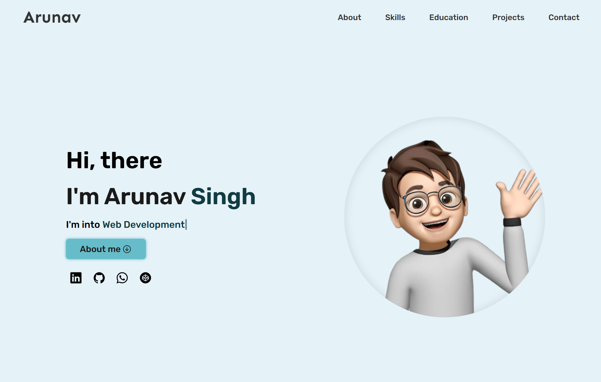

# Arunav Singh - Web Developer Portfolio

Welcome to my personal portfolio website! 🚀  
This site showcases my professional journey, projects, and skills.

---

## 🔗 **Live Demo**

You can check out the live website here:  
[arunavsingh.netlify.app](https://arunavsingh.netlify.app/)

---

## 📄 **Description**

This portfolio website is designed to:

- Display my **projects** and their details.
- Highlight my **technical skills** and knowledge.
- Provide a clean, responsive, and interactive user experience.

---

## 🛠️ **Technologies Used**

The website was built using:

- **React.js** - For building the user interface.
- **HTML5** & **CSS3** - For structuring and styling the site.
- **JavaScript** - Adding interactivity and logic.
- **Netlify** - For hosting and deployment.

---

## 📁 **Project File Structure**

```plaintext
public/
src/
├───assets/                # General reusable assets
├───Components/            # React components
│   ├───Footer Component/  # Footer section
│   ├───Header Component/  # Header section
│   └───Main Component/    # Main content area
│       └───Contents/      # Individual content files
├───Dynamic Data/          # Data stored dynamically for reuse
│   └───Data Stored/       # JSON or other stored data files
├───img/                   # Images used in the site
│   └───Projects Screenshots/  # Screenshots of projects
├───logo/                  # Logo images
│   └───tech-logo/         # Tech stack logos
└───My Memoji/             # Custom memoji assets
    └───Without background/ # Background-less memojis
```

---

## 📸 **Screenshots**



---

## 🚀 **Features**

- **Responsive Design**: Works seamlessly on mobile, tablet, and desktop devices.
- **Dynamic Content**: Projects, skills, and content are dynamically updated.
- **Interactive UI**: Smooth animations and user-friendly navigation.
- **Project Showcase**: Highlight detailed information about my work.
- **Custom Design**: A clean and modern design tailored to reflect my personality.

---

## 📲 **Contact Me**

Feel free to connect or reach out:

- **Email**: arunavsingh999@gmail.com
- **LinkedIn**: [arunav-singh](https://www.linkedin.com/in/arunav-singh-61241b171/)
- **GitHub**: [arunav999](https://github.com/arunav999)

---

### ⭐ If you find this project helpful, don't forget to give it a star on GitHub! ⭐

---

Developed By: Arunav Singh 